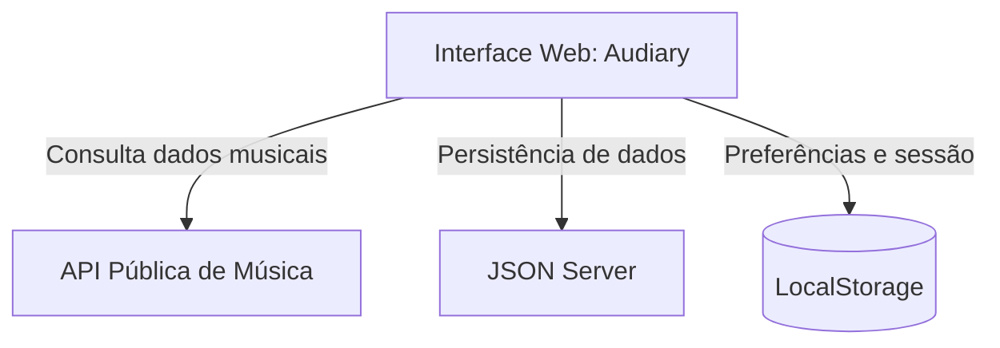

# 🎧 Audiary

### *Keep track of what you hear*

Uma plataforma de catalogação, descoberta e registro de experiências musicais — inspirada no Letterboxd, mas para os álbuns que você ouve.


---

## 👤 Identificação/Autor

**Leonardo Nicolau Skorobohatei**

## 📖 Sobre o projeto

Enquanto os serviços de streaming são feitos para **tocar** música, o **Audiary** é feito para você **lembrar** dela.

O objetivo é funcionar como um diário musical digital: um espaço onde você registra os álbuns que ouviu, atribui notas, escreve resenhas e constrói, aos poucos, um histórico da sua própria trajetória musical.

## ✨ Funcionalidades

- 🔍 **Busca de artistas e álbuns** através de uma API pública de música
- 🎵 **Registro de audição** — marque álbuns como ouvidos, com data
- ⭐ **Avaliações** de 1 a 5 estrelas
- 📝 **Resenhas** — escreva, edite e exclua suas impressões sobre cada álbum
- 📚 **Biblioteca pessoal** com os álbuns que você já ouviu
- ❤️ **Favoritos** para acessar rapidamente o que você mais gosta
- 📌 **Listenlist** — sua lista de desejos musicais
- 👤 **Perfil** com todo o seu histórico, avaliações e resenhas
- 🎚️ Filtros por **gênero** e **ano de lançamento**

## 🛠️ Tecnologias e Dependências

- **HTML5:** estrutura das páginas.
- **CSS3:** estilização e layouts personalizados.
- **Sass/SCSS:** organização e modularização dos estilos.
- **JavaScript:** lógica e interatividade da aplicação.
- **jQuery & Plugins:** manipulação do DOM e aplicação de máscaras em formulários (jQuery Mask Plugin).
- **Node.js e NPM:** gerenciamento de dependências e ferramentas do projeto.
- **JSON Server:** API fake para persistência e consulta dos dados.
- **ESLint:** análise estática e padronização do código JavaScript.
- **Prettier:** formatação automática do código.
- **Git/GitHub:** versionamento e gerenciamento do código-fonte.

- **Framework CSS:** O Bootstrap foi escolhido como framework CSS principal pois ele é a framework
que mais oferece um equilíbrio entre funcionalidade e estética para o Audiary. Com o Bootsrap é possível
oferecer uma responsividade do layout sem sacrificar a identidade visual do Audiary.

- **API Pública:** A API pública de música escolhida foi a API do Last.fm (Last.fm API) pois ela 
é a API que mais se encaixa na proposta do Audiary pois ela oferece tudo que a página necessita,
como nome de álbuns, imagens da capa em diferentes tamanhos, nome do artista e tags de genêro exatas.

## 🏗️ Arquitetura



- **Interface Web** — apresentação das páginas e interação com o usuário
- **API Pública de Música** — artistas, álbuns, capas, gêneros e faixas
- **JSON Server** — simula o backend, persistindo dados de audição, avaliações, resenhas e listas
- **LocalStorage** — preferências de interface e dados de sessão

## 🗂️ Modelo de dados (resumo)

- **Usuário** → possui registros de audição, resenhas e lista de desejos
- **Álbum** → recebe registros de audição, resenhas e pode estar na lista de desejos
- **Registro de Audição** → data, nota e status de favorito
- **Resenha** → texto e data de criação
- **Lista de Desejos** → álbuns a ouvir no futuro

## ✅ Checklist de Funcionalidades

**MVP**
- [ ] Busca de artistas e álbuns
- [ ] Visualização de informações de álbuns
- [ ] Registro de álbuns ouvidos
- [ ] Sistema de avaliação (1–5 estrelas)
- [ ] Resenhas
- [ ] Biblioteca pessoal
- [ ] Perfil do usuário

**Próximos passos**
- [ ] Sistema de favoritos
- [ ] Listenlist
- [ ] Filtros por gênero e ano

**Futuro**
- [ ] Ordenação do histórico (data, nota, título)
- [ ] Estatísticas pessoais de audição
- [ ] Sugestões de álbuns por gênero favorito

## 🚀 Instruções de Execução

```bash
# Clone o repositório
git clone https://github.com/seu-usuario/audiary.git

# Acesse a pasta do projeto
cd audiary

# Instale as dependências
npm install

# Inicie a API fake (JSON Server)
npm run server

# Inicie a aplicação
npm start
```

> Ajuste os comandos acima conforme os scripts definidos no seu `package.json`.

## 📖 Checklist | Indicadores de Desempenho (ID)

**Link:** [Checklist de IDs](docs/checklist-IDs.md)

## 🙅 Fora do escopo (por enquanto)

- Reprodução de áudio dentro da aplicação
- Importação automática de histórico (Spotify, Apple Music, etc.)
- Sistema de seguidores e interação social

---

<p align="center">Feito com 🎶 para quem leva a música a sério.</p>
